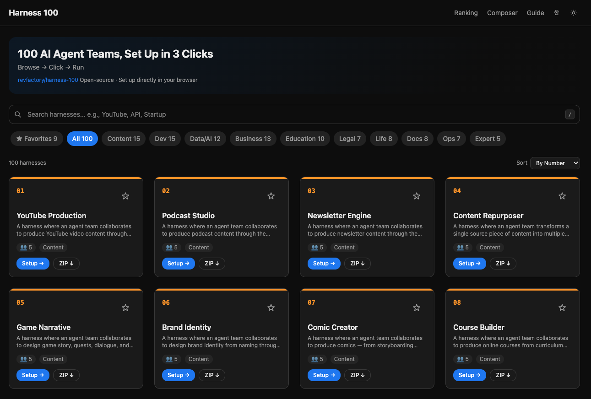

# Harness 100

**100 AI Agent Teams, Set Up in 3 Clicks**

[](LICENSE)

[English](#english) | [한국어](#한국어)

---

## English

A web app to browse, customize, and set up 100 [Claude Code](https://docs.anthropic.com/en/docs/claude-code) harnesses (agent teams + orchestrator skills) directly into your projects.

> **Browse → Click → Run**
>
> Open-source · No login required · Set up directly in your browser

Based on [revfactory/harness-100](https://github.com/revfactory/harness-100).



### Features

- **Catalog** — 10 categories, fuzzy search, sort by number / popularity / name
- **3 Setup Methods** — Browser direct setup (File System Access API) / ZIP download / CLI copy
- **Conflict Detection & Merge** — Overwrite, skip, or merge when `.claude/` files already exist
- **Customization** — Edit agent names, roles, and output templates before setup
- **Harness Composer** — Combine agents from multiple harnesses into a custom workflow
- **Popularity Ranking** — Community top 10 harnesses
- **Favorites** — Locally persisted, viewable in favorites tab
- **Multilingual** — English / Korean
- **Dark Mode** — System preference + manual toggle

### Demo

**https://harness100.vercel.app**

### Quick Start

```bash
git clone https://github.com/OkyoKwon/harness-100.git
cd harness-100
pnpm install
pnpm dev
```

Open http://localhost:3000.

### Scripts

| Command | Description |
|---------|-------------|
| `pnpm dev` | Development server |
| `pnpm build` | Static build (→ `out/`) |
| `pnpm test` | Run tests |
| `pnpm test:coverage` | Tests with coverage |
| `pnpm storybook` | Run Storybook |
| `pnpm seed` | Fetch harness data from GitHub |

### Tech Stack

| Area | Technology |
|------|-----------|
| Framework | Next.js 16 (App Router, Static Export) |
| Language | TypeScript 6 |
| Styling | Tailwind CSS 4 |
| Testing | Vitest + Testing Library + MSW |
| Storybook | Storybook 10 |
| Package Manager | pnpm 10 |
| Deployment | Vercel |

### License

[Apache License 2.0](LICENSE)

---

## 한국어

[Claude Code](https://docs.anthropic.com/en/docs/claude-code)용 하네스(에이전트 팀 + 오케스트레이터 스킬) 100개를 탐색하고, 커스터마이즈하고, 바로 프로젝트에 세팅할 수 있는 웹앱입니다.

> **고르고 → 클릭하고 → 바로 실행**
>
> 오픈소스 기반 · 로그인 없이 · 브라우저에서 바로 세팅

[revfactory/harness-100](https://github.com/revfactory/harness-100) 기반으로 제작되었습니다.

### 주요 기능

- **카탈로그 탐색** — 10개 카테고리, 퍼지 검색, 번호순/인기순/이름순 정렬
- **3가지 세팅 방식** — 브라우저 직접 세팅 (File System Access API) / ZIP 다운로드 / CLI 복사
- **충돌 감지 & 병합** — 기존 `.claude/` 파일이 있으면 덮어쓰기/건너뛰기/병합 선택
- **커스터마이즈** — 에이전트 이름, 역할, 산출물 템플릿 수정 후 세팅
- **하네스 조합** — 여러 하네스의 에이전트를 조합하여 나만의 워크플로우 생성
- **인기 순위** — 커뮤니티 인기 Top 10 하네스
- **즐겨찾기** — 로컬 저장, 즐겨찾기 탭에서 모아보기
- **다국어** — 한국어 / English
- **다크 모드** — 시스템 설정 연동 + 수동 전환

### 데모

**https://harness100.vercel.app**

### 빠른 시작

```bash
git clone https://github.com/OkyoKwon/harness-100.git
cd harness-100
pnpm install
pnpm dev
```

http://localhost:3000 에서 확인하세요.

### 스크립트

| 명령어 | 설명 |
|--------|------|
| `pnpm dev` | 개발 서버 |
| `pnpm build` | 정적 빌드 (→ `out/`) |
| `pnpm test` | 테스트 실행 |
| `pnpm test:coverage` | 커버리지 포함 테스트 |
| `pnpm storybook` | 스토리북 실행 |
| `pnpm seed` | GitHub에서 하네스 데이터 가져오기 |

### 기술 스택

| 영역 | 기술 |
|------|------|
| 프레임워크 | Next.js 16 (App Router, Static Export) |
| 언어 | TypeScript 6 |
| 스타일 | Tailwind CSS 4 |
| 테스트 | Vitest + Testing Library + MSW |
| 스토리북 | Storybook 10 |
| 패키지 매니저 | pnpm 10 |
| 배포 | Vercel |

### 라이선스

[Apache License 2.0](LICENSE)
